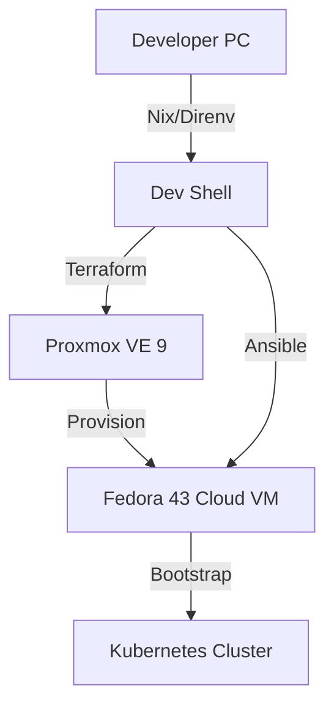

[](README_ja.md)

# Home Lab Kubernetes Infrastructure (IaC)
...


A complete **Infrastructure as Code (IaC)** repository to provision a Kubernetes cluster on **Proxmox VE 9**.

## 🚀 Key Features

* **Reproducible Environment:** Uses **Nix & Direnv** to manage development tools (Terraform, Ansible, kubectl). No manual installation required on the host machine.
* **Modern Proxmox Support:** Utilizes the `bpg/proxmox` provider to support **Proxmox VE 9+**, solving API compatibility issues found in legacy providers.
* **Immutable Infrastructure Principles:** Deploys **Fedora Cloud Base Images** via Cloud-Init, ensuring clean and consistent VM provisioning.
* **Declarative Configuration:**
    * **Terraform:** Manages VM lifecycle (Compute, Network, Storage).
    * **Ansible:** Manages OS configuration and Kubernetes (Kubeadm) bootstrapping.

## 🏗️ Architecture



## 🛠️ Tech Stack

| Category | Technology | Reason for Selection |
| :--- | :--- | :--- |
| **Dev Environment** | **Nix + Direnv** | To guarantee tool version consistency across different machines and keep the host OS clean. |
| **Provisioning** | **Terraform** | Industry standard for infrastructure lifecycle management. Used `bpg/proxmox` for v9 compatibility. |
| **Configuration** | **Ansible** | Agentless configuration management. Ideal for bootstrapping Kubeadm and OS settings. |
| **Virtualization** | **Proxmox VE** | Powerful, open-source Type-1 hypervisor. |
| **OS** | **Fedora Cloud** | Up-to-date kernel features and SELinux integration, suitable for modern container workloads. |

## ⚡ Quick Start

### Prerequisites
* Nix installed
* Direnv installed
* Proxmox VE 8.x or 9.x

### 1. Setup Development Environment
Just enter the directory. Nix will automatically fetch Terraform, Ansible, and other tools.
```bash
direnv allow
```

### 2. Configure Secrets
Copy the example file and define your Proxmox credentials.
```bash
cp terraform.tfvars.example terraform.tfvars
# Edit pve_endpoint, pve_user, token, and ssh_key
```

### 3. Provision Infrastructure (Terraform)
```bash
terraform init
terraform plan
terraform apply
```

### 4. Bootstrap Kubernetes (Ansible)
Create inventory file and run the playbook.
```bash
cp inventory.ini.example inventory.ini
# Edit IP address
ansible-playbook -i inventory.ini site.yml
```

## 🔜 Roadmap
* [ ] Integrate **ArgoCD** for GitOps-based application deployment.
* [ ] Implement **Renovate** for dependency updates.
* [ ] Integrate **Cloudflare Tunnel** for secure remote access without opening ports.
* [ ] Deploy **Longhorn** or **Rook/Ceph** for distributed block storage and backups.
* [ ] Implement **Prometheus & Grafana** stack for cluster monitoring and alerting.
* [ ] Setup **Loki** or **Fluent Bit** for centralized log aggregation.
* [ ] Implement **Sealed Secrets** or **External Secrets Operator** for encrypted GitOps secrets.

## 📝 License
This project is licensed under the MIT License.
