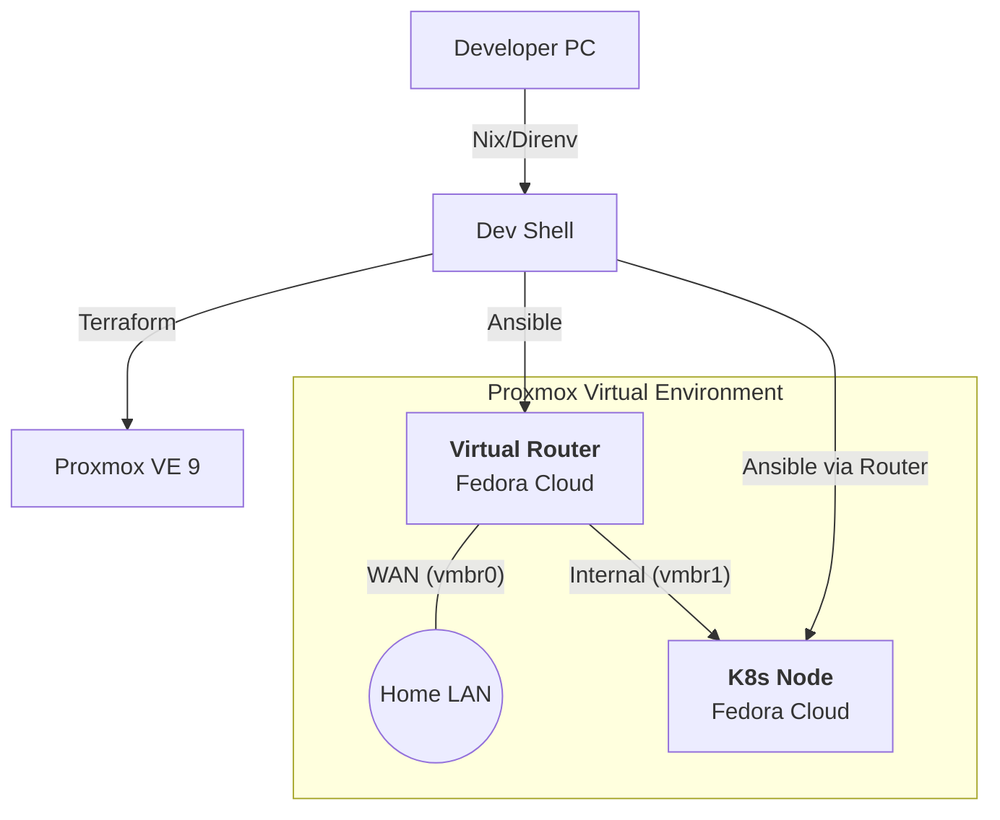

[](README.md)

# Home Lab Kubernetes Infrastructure (IaC)


**Proxmox VE 9** 上にKubernetesクラスタをプロビジョニングするための完全な **Infrastructure as Code (IaC)** リポジトリ。
仮想ルーター（NFV）によるネットワーク分離と、宣言的な構成管理によるモダンな自宅ラボ（Home Lab）構築を実践。

## 🚀 主な特徴

* **再現可能な開発環境:** **Nix & Direnv** を使用して開発ツール（Terraform, Ansible, kubectl）を一元管理。ホストマシンへの手動インストールやバージョン管理の手間を排除。
* **Network Function Virtualization (NFV):** Fedoraベースの仮想ルーターを展開し、Kubernetesクラスタを内部ネットワークに隔離。NATおよびIPマスカレードによるセキュアな通信経路を確立。
* **モダンなProxmoxサポート:** **Proxmox VE 9+** に完全対応するため、最新の `bpg/proxmox` プロバイダを採用。
* **Immutable Infrastructure:** Cloud-Initを通じて **Fedora Cloud Base Images** をデプロイし、常にクリーンで一貫性のあるVMプロビジョニングを保証。
* **宣言的な構成管理:**
    * **Terraform:** VMのライフサイクル（コンピュート、ネットワーク、ストレージ）を管理。
    * **Ansible:** OS設定、ルーター構築、Kubernetes (Kubeadm) のブートストラップを管理。

## 🏗️ アーキテクチャ



## 🛠️ 技術スタックと選定理由

| カテゴリ | 技術 | 選定理由 |
| :--- | :--- | :--- |
| **開発環境** | **Nix + Direnv** | 異なるマシン間でのツールバージョンの一貫性を保証し、ホストOSを汚さないため。 |
| **プロビジョニング** | **Terraform** | インフラライフサイクル管理の業界標準。v9互換性のために `bpg/proxmox` を採用。 |
| **構成管理** | **Ansible** | エージェントレスで軽量。ルーターのネットワーク設定からK8s構築まで一貫して管理可能。 |
| **ネットワーク** | **Linux Router (NFV)** | 物理ネットワーク構成を変更せず、IaCのみで完結する分離ネットワーク環境（SDN）を構築するため。 |
| **仮想化基盤** | **Proxmox VE** | 強力で柔軟なオープンソースのType-1ハイパーバイザー。 |
| **OS** | **Fedora Cloud** | 最新のカーネル機能とSELinux統合が利用でき、モダンなコンテナワークロードに最適。 |

## ⚡ クイックスタート

### 前提条件

  * Nix がインストールされていること
  * Direnv がインストールされていること
  * Proxmox VE 8.x または 9.x 環境があること

### 1\. 開発環境のセットアップ

ディレクトリに移動するだけで、Nixが自動的にTerraformやAnsibleなどのツールをセットアップ。

```bash
direnv allow
```

### 2\. 認証情報の設定

Exampleファイルをコピーし、Proxmoxの認証情報などを定義。

```bash
cp terraform.tfvars.example terraform.tfvars
# pve_endpoint, pve_user, token, ssh_key, router_ip などを編集
```

### 3\. インフラのプロビジョニング (Terraform)

ルーターVMとKubernetesノードVMを作成。

```bash
terraform init
terraform plan
terraform apply
```

### 4\. ネットワークとクラスタの構築 (Ansible)

インベントリファイルを作成し、**ルーター構築 → クラスタ構築** の順で実行。

```bash
cp inventory.ini.example inventory.ini
# ルーターとK8sノードのIPアドレスを記述

# 1. 仮想ルーターのセットアップ (NAT/Firewall有効化)
ansible-playbook -i inventory.ini router.yml

# 2. Kubernetesクラスタ & ArgoCDの構築
ansible-playbook -i inventory.ini site.yml
```

## 🔜 ロードマップ

  * [x] **ArgoCD** の導入によるGitOpsベースのアプリケーションデプロイ
  * [ ] **MetalLB** の導入による内部ロードバランシング（Layer 2）
  * [ ] **Renovate** の導入による依存関係更新の自動化
  * [ ] **Cloudflare Tunnel** を利用したポート開放不要のセキュアなリモートアクセス
  * [ ] **Longhorn** または **Rook/Ceph** による分散ブロックストレージとバックアップの実装
  * [ ] **Prometheus & Grafana** スタックによるクラスタ監視とアラート設定
  * [ ] **Loki** または **Fluent Bit** によるログ集約基盤の構築
  * [ ] **Sealed Secrets** または **External Secrets Operator** によるGitOps上の機密情報管理

## 📝 ライセンス

This project is licensed under the MIT License.
